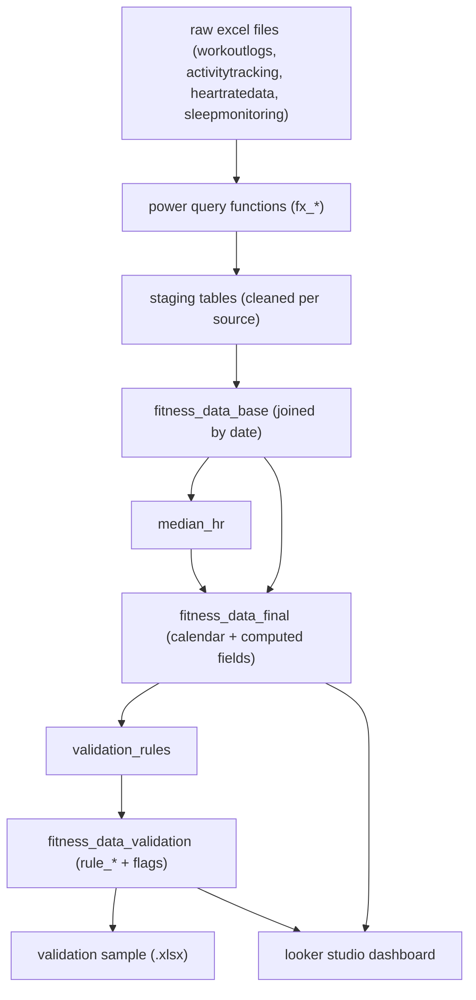

# fitness analytics etl + bi  
## power query etl • validation • looker studio bi dashboard

this end-to-end analytics project demonstrates a **complete etl and data validation process in power query**, followed by the creation of an **interactive bi dashboard in looker studio**.
the workflow covers raw data ingestion, cleaning, transformation, validation, enrichment, and performance visualization

## project structure
 ```
fitness-analytics-etl-bi
│
├── 📁 data/
│   ├── 📁 sample/
│   │   ├── fitness_data_raw_sample.xlsx
│   │   └── fitness_data_validation_sample.xlsx
│   └── README.md
│   
├── 📁 etl/
│   ├── etl_pipeline.md          
│   ├── etl_walkthrough.md     
│   ├── README.md   
│   └── 📁 functions/
│       ├── fx_clean.pq
│       ├── fx_text.pq
│       ├── fx_date.pq
│       ├── fx_number.pq
│       ├── fx_to_minutes.pq
│       ├── fx_to_hours.pq
│       ├── fx_to_km.pq
│       └── README.md
│
├── 📁 validation/
│   ├── validation_walkthrough.md
│   ├── validation_rules.pq         
│   ├── validation_summary.pq    
│   ├── README.md   
│   └── 📁 functions/
│       ├── fx_is_null_or_blank.pq
│       ├── fx_is_numeric.pq
│       ├── fx_is_between.pq
│       ├── fx_in_set.pq
│       ├── fx_list_broken.pq
│       └── README.md
│
├── 📁 bi/
│   ├── 📁 looker_studio/
│   │   ├── report_overview.md
│   │   ├── calculated_fields.md
│   │   ├── color_system.md
│   │   ├── tooltip_catalog.md
│   │   └── README.md
│   └── 📁 assets/
│       ├── 📁 screenshots/       
│       └── README.md
│
├── 📁 docs/
│   ├── data_dictionary.md       
│   ├── kpi_definitions.md
│   ├── project_overview.md      
│   └── README.md
│
├── 📁 .github/
│   ├── bug_report.md
│   └── feature_request.md
│
├── LICENSE
├── .gitignore
└── README.md
 ```

## documentation index
| file | folder | description |
|------|---------|-------------|
| [`data_dictionary.md`](./docs/data_dictionary.md) | `/docs` | full column-level metadata including validation and quality flags |
| [`kpi_definitions.md`](./docs/kpi_definitions.md) | `/docs` | kpi and metric calculation logic used in the dashboard |
| [`etl_pipeline.md`](./etl/etl_pipeline.md) | `/etl` | etl architecture overview and power query data flow |
| [`etl_walkthrough.md`](./etl/etl_walkthrough.md) | `/etl` | step-by-step transformation guide for the etl pipeline |
| [`validation_walkthrough.md`](./validation/validation_walkthrough.md) | `/validation` | detailed explanation of validation logic, structure, and rule application |
| [`validation_rules.md`](./validation/validation_rules.md) | `/validation` | parameterized list of validation rules with thresholds, columns, and severities |
| [`validation_summary.md`](./validation/validation_summary.md) | `/validation` | aggregated counts by validation category (valid, check, invalid, nodata) and completeness |
| [`report_overview.md`](./dashboard/report_overview.md) | `/dashboard` | looker studio dashboard layout, interactions, and metrics mapping |
| [`portfolio_summary.md`](./docs/portfolio_summary.md) | `/docs` | executive project summary for portfolio presentation |

## project goals
- build a modular **power query etl pipeline** for fitness tracking data  
- apply **data validation logic** via dynamic rule tables  
- produce a **clean, analytics-ready dataset** for visualization  
- design an **interactive dashboard** showing health, activity, and recovery trends  
- maintain full **documentation and reproducibility** via github

## data overview
| category | details |
|-----------|----------|
| **source** | synthetic dataset (excel), split into raw input sheets (`WorkoutLogs`, `ActivityTracking`, `HeartRateData`, `SleepMonitoring`) |
| **size** | ~1,600 rows combined (≈400 per sheet) |
| **issues handled** | mixed date/time formats, inconsistent units, nulls, duplicates, missing days (calendar auto-generation), and data quality anomalies |
| **final output** | single validated table `fitness_data_validation` containing all cleaned and enriched columns, ready for bi integration |

## tech stack
| tool | purpose |
|------|----------|
| **power query (excel / m language)** | data ingestion, transformation, validation, and feature engineering |
| **looker studio** | interactive dashboard creation |
| **github** | version control and technical documentation |


## ETL architecture


## custom M functions
| function | purpose |
|-----------|----------|
| `fx_clean` | normalizes headers, trims text, removes empty rows |
| `fx_date` | parses multiple date formats and Excel serials |
| `fx_text` | cleans and standardizes text casing and punctuation |
| `fx_number` | safely converts text/numeric inputs |
| `fx_to_minutes` | converts durations (e.g. “1h 30m”, “90m”) to minutes |
| `fx_to_hours` | converts durations or timestamps (e.g. “06:30”) to hours |
| `fx_to_km` | converts distances between km, m, and miles |
| `fx_null_or_blank` | returns true if the field is null or empty string |
| `fx_is_between` | checks if numeric values fall within inclusive ranges |
| `fx_in_set` | checks categorical values against a reference list |
| `fx_list_broken` | lists failed validation rules for each record |
| `fx_is_numeric` | ensures values are valid numeric types |

see detailed function documentation:  
- [`/etl/functions/README.md`](./etl/functions/README.md)  
- [`/validation/functions/README.md`](./validation/functions/README.md)

## dashboard highlights
- **tool**: looker studio
- **pages**: executive overview, workout analytics, health & recovery
- **key metrics & fields**:
  - KPI cards: total workouts, workout consistency, goal achievement
  - performance breakdown: calories/min trends, intensity structure
  - activity & sleep trends: sleep duration analysis, resting hr trend, recovery pattern, previous-night sleep → next-day calories & workout duration
- **interactions**
  - cross-filtering: selecting any chart element filters related visuals
  - month & workout type selectors + reset
  - drill-down: recovery timeline by quarter → month → day of week
  - optional metrics on workout type comparison bar chart
- **tooltips**: tooltip-driven insights and detailed metrics for user-friendly storytelling
- **consistent color system**: per workout type & intensity tiers (high/medium/low)

## reproduce guide
### prerequisites
before reproducing the project, make sure you have:
- **microsoft excel 365** with **power query** enabled  
- **looker studio** access  
### quick start
1. **clone the repository**
   ```bash
   git clone https://github.com/<your-username>/fitness-analytics-dashboard.git
2. **open etl base files**
  - open source sample `/data/sample/fitness_data_raw_sample.xlsx` to review the raw synthetic data
  - import all M functions from `/etl/functions` and `/validation/functions` into Power Query
  - follow transformation steps described in [`etl_walkthrough.md`](./etl/etl_walkthrough.md)
4. **explore validation layer**
  - load `validation_rules` and follow the logic in [`validation_walkthrough.md`](./validation/validation_walkthrough.md)
  - open `/data/sample/fitness_data_validation_sample.xlsx` to view cleaned and validated records
5. **open dashboard in looker studio**
  - use the validated dataset as your data source
  - check KPI cards, trends, and filters defined in [`report_overview.md`](./dashboard/report_overview.md)
6. **provide feedback or contribute**  
   - submit ideas or issues via  
     [`/.github/feature_request.md`](./.github/feature_request.md) or [`/.github/bug_report.md`](./.github/bug_report.md)
     
## license
- this project is released under the **mit license**
- feel free to reuse or adapt parts of this repository for educational and analytical purposes

## connect
**Monika Burnejko**
*data analyst in training | excel & power query | bi & automation enthusiast*  
📧 [monikaburnejko@gmail.com](mailto:monikaburnejko@gmail.com)  
💼 [linkedin](https://www.linkedin.com/in/monika-burnejko-9301a1357)  
🌐 [portfolio](https://www.notion.so/monikaburnejko/Data-Analytics-Portfolio-2761bac67ca9807298aee038976f0085?pvs=9)

---
<p align="center">
⭐ if you found this project helpful, please consider giving it a star!
</p>`
