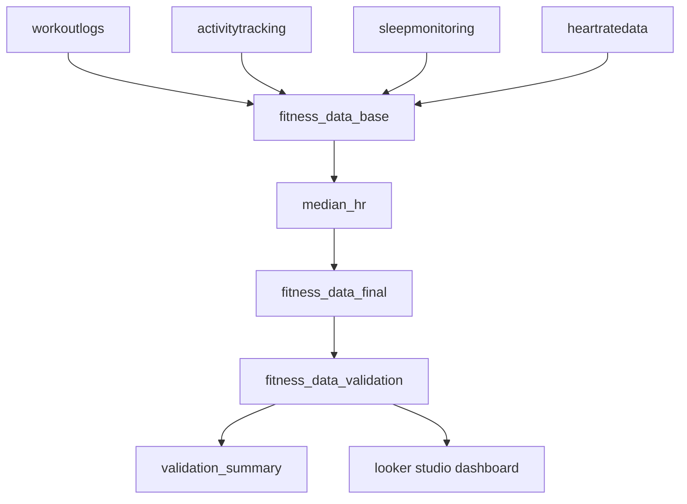

# fitness analytics etl + bi  
### power query etl • validation • looker studio dashboard

an end-to-end analytics project demonstrating a **complete data pipeline in power query (m language)** with **rule-based validation** and an **interactive bi dashboard in looker studio**.  
the workflow covers data ingestion, cleaning, transformation, validation, enrichment, and visualization - all fully documented and reproducible.

## project overview
**etl + validation summary:**  
for a complete overview of the data flow and outputs, see ➡️ [etl_summary.md](./etl_summary.md)

## repository structure
```
fitness-analytics-etl-bi/
│  
├── 📁 etl/                              
│   ├── etl_pipeline.md          
│   ├── etl_walkthrough.md     
│   ├── README.md
│   ├── 📁 queries/
│   │   ├── workoutlogs.pq
│   │   ├── activitytracking.pq
│   │   ├── sleepmonitoring.pq
│   │   ├── heartratedata.pq
│   │   ├── fitness_data_base.pq
│   │   ├── median_hr.pq
│   │   ├── fitness_data_final.pq
│   │   └── README.md  
│   └── 📁 functions/
│       ├── fx_clean.pq
│       ├── fx_text.pq
│       ├── fx_date.pq
│       ├── fx_number.pq
│       ├── fx_to_minutes.pq
│       ├── fx_to_hours.pq
│       ├── fx_to_km.pq
│       └── README.md
│
├── 📁 validation/
│   ├── validation_walkthrough.md  
│   ├── README.md
│   ├── 📁 queries/
│   │   ├── validation_rules.pq
│   │   ├── fitness_data_validation.pq
│   │   ├── validation_summary.pq
│   │   └── README.md     
│   └── 📁 functions/
│       ├── fx_is_null_or_blank.pq
│       ├── fx_is_numeric.pq
│       ├── fx_is_between.pq
│       ├── fx_in_set.pq
│       ├── fx_list_broken.pq
│       └── README.md
│
├── 📁 data/
│   ├── 📁 sample/
│   │   ├── fitness_data_raw_sample.xlsx
│   │   └── fitness_data_validation_sample.xlsx
│   └── README.md
│
├── 📁 bi/
│   ├── 📁 looker_studio/
│   │   ├── report_overview.md
│   │   ├── calculated_fields.md
│   │   ├── color_system.md
│   │   ├── tooltip_catalog.md
│   │   └── README.md
│   └── 📁 assets/
│       ├── 📁 screenshots/       
│       └── README.md
│
├── 📁 docs/
│   ├── data_dictionary.md       
│   ├── kpi_definitions.md
│   ├── project_overview.md      
│   └── README.md
│
├── 📁 .github/
│   ├── 📁 ISSUE_TEMPLATE/
│   │   ├── bug_report.md
│   │   ├── feature_request.md
│   │   └── config.yml
│   ├── PULL_REQUEST_TEMPLATE.md
│   └── CONTRIBUTING.md
│
├── LICENSE
├── .gitignore
├── etl_summary.md
└── README.md
```

## documentation index
| file | description |
|------|--------------|
| [`etl_pipeline.md`](./etl/etl_pipeline.md) | high-level overview of etl architecture and flow |
| [`etl_walkthrough.md`](./etl/etl_walkthrough.md) | step-by-step transformation guide for all queries |
| [`validation_walkthrough.md`](./validation/validation_walkthrough.md) | logic and structure of the validation layer |
| [`data_dictionary.md`](./docs/data_dictionary.md) | column-level metadata and validation flag meanings |
| [`kpi_definitions.md`](./docs/kpi_definitions.md) | definitions of kpis and calculated fields |
| [`report_overview.md`](./bi/looker_studio/report_overview.md) | dashboard structure, interactions, and metrics mapping |
| [`portfolio_summary.md`](./docs/portfolio_summary.md) | executive project summary for portfolio presentation |

## project goals
- design a **modular etl pipeline** in power query for fitness tracking data  
- apply **dynamic validation rules** to ensure data quality  
- deliver a **clean, analytics-ready dataset** for visualization  
- build an **interactive looker studio dashboard** for insight discovery  
- ensure **full reproducibility and transparency** via github documentation  

## data overview
| category | details |
|-----------|----------|
| **source** | synthetic dataset (`fitness_data_2024_raw.xlsx`) with 4 sheets: `workoutlogs`, `activitytracking`, `sleepmonitoring`, `heartratedata` |
| **sample files** | [`fitness_data_raw_sample.xlsx`](./data/sample/fitness_data_raw_sample.xlsx) and [`fitness_data_validation_sample.xlsx`](./data/sample/fitness_data_validation_sample.xlsx) |
| **size** | ~1,600 rows total (≈400 per sheet) |
| **handled issues** | mixed formats, inconsistent units, missing days, nulls, duplicates, out-of-range metrics |
| **final outputs** | `fitness_data_final` (etl) → `fitness_data_validation` + `validation_summary` (validation) |

##  etl → validation → bi flow


## key functions
| category | main functions | purpose |
|-----------|----------------|----------|
| **etl** | `fx_clean`, `fx_date`, `fx_number`, `fx_to_minutes`, `fx_to_hours`, `fx_to_km`, `fx_text` | data normalization, type parsing, unit conversion |
| **validation** | `fx_null_or_blank`, `fx_is_between`, `fx_in_set`, `fx_is_numeric`, `fx_list_broken` | rule-based validation and error flagging |

📘 see detailed documentation:  
- [`/etl/functions/README.md`](./etl/functions/README.md)  
- [`/validation/functions/README.md`](./validation/functions/README.md)

## dashboard highlights
- **tool:** looker studio  
- **main views:** overview, performance breakdown, health & recovery  
- **interactivity:** cross-filtering, segment drill-downs, month/workout filters  
- **kpis:** total workouts, goal achievement %, workout consistency  
- **trends:** calories/min, resting hr, sleep pattern, recovery correlation  
- **design:** consistent color system + tooltip-based insights  

more info: [`report_overview.md`](./bi/looker_studio/report_overview.md)

## reproduce the project
### prerequisites
before reproducing the project, make sure you have:
- **microsoft excel 365** with **power query** enabled  
- **looker studio** access  
### quick start
1. **clone the repository**
   ```bash
   git clone https://github.com/moniburnejko/fitness-analytics-etl-bi.git
   ```
2.	**open the raw data sample**
- /data/sample/fitness_data_raw_sample.xlsx
3.	**load functions into power query**
- from /etl/functions and /validation/functions
4.	**follow the etl process**
- see [`etl_walkthrough.md`](./etl/etl_walkthrough.md)
5.	**run validation**
- see [`validation_walkthrough.md`](./validation/validation_walkthrough.md)
6.	**connect to looker studio**
- use fitness_data_validation.xlsx as your source
- rebuild visuals based on [`report_overview.md`](./dashboard/report_overview.md)
7.	**report issues or contribute**
   
## license
this project is released under the **mit license**.
feel free to reuse or adapt parts of this repository for educational and analytical purposes

## connect
**Monika Burnejko**
<br>*data analyst in training | excel & power query | bi & automation enthusiast*  
📧 [monikaburnejko@gmail.com](mailto:monikaburnejko@gmail.com)  
💼 [linkedin](https://www.linkedin.com/in/monika-burnejko-9301a1357)  
🌐 [portfolio](https://www.notion.so/monikaburnejko/Data-Analytics-Portfolio-2761bac67ca9807298aee038976f0085?pvs=9)

---
<p align="center">
⭐ if you found this project helpful, please consider giving it a star!
</p>`
