# 📊 Sample Data

This folder contains two representative sample files (25 records each) used to illustrate the data cleaning, transformation, and validation process.

## Included Files

| File | Description |
|------|--------------|
| **`fitness_data_raw_sample.xlsx`** | Raw source data split across 4 sheets (`WorkoutLogs`, `ActivityTracking`, `SleepMonitoring`, `HeartRateData`). Each sheet contains examples of messy, inconsistent, and incomplete records collected from different fitness trackers. |
| **`fitness_data_validation_sample.xlsx`** | Unified and validated dataset after full ETL processing. All transformations and data quality checks have been applied. Contains a single sheet named `fitness_data_validation` with final standardized columns. |

## Data Quality Issues (Raw Sample)

The `fitness_data_raw_sample.xlsx` file intentionally contains messy and inconsistent records,  
used to demonstrate the data cleaning and validation process during ETL.

| Issue Type | Example | Impact | Resolution in ETL |
|-------------|----------|---------|-------------------|
| Inconsistent date formats | `12/03/24`, `2024-03-12`, Excel serial `45377` | Parsing errors, wrong chronological order | Standardized with `fx_date` |
| Missing days in time series | No entry for `2024-02-14`, `2024-02-15` | Broken temporal analysis, inaccurate streak or consistency calculations | Rebuilt continuous calendar (`List.Dates`) to ensure full 2024 coverage |
| Mixed numeric formats | `7.5`, `7,5`, `7 500`, `"~420"` | Type conversion errors | Normalized with `fx_number` |
| Mixed duration units | `1:30`, `90m`, `"6.5h"` | Wrong time aggregation | Converted using `fx_to_minutes` and `fx_to_hours` |
| Mixed distance units | `5km`, `3.2 mi`, `400m` | Incorrect distance totals | Unified via `fx_to_km` |
| Missing or mis-typed activity names | `hiit session`, `Yoga`, blank rows | Duplicates and orphaned metrics | Cleaned and standardized via `fx_text` and canonical mapping |
| Duplicated entries | Two identical `WorkoutLogs` rows | Inflated daily totals | Removed using `Table.Distinct` |
| Null or incomplete HR data | `average_hr = null`, `max_hr = 200` | Skewed training intensity classification | Replaced with per-type median via `median_hr` table |

*Each issue category corresponds to a specific transformation or validation step within the Power Query ETL pipeline documented in the `/etl` folder.*

## Key Differences Between Versions

| Aspect | Raw Sample | Validation Sample |
|---------|-------------|-------------------|
| **Structure** | Four fragmented tables with inconsistent schema | One consolidated table (`fitness_data_validation`) |
| **Formatting** | Mixed date/time formats, numeric strings, and text noise | Standardized types: `date`, `number`, `text`, and `logical` |
| **Duplicates** | Includes duplicate or overlapping entries | Fully deduplicated and chronologically aligned |
| **Missing Data** | Frequent nulls, blanks, and inconsistent metrics | Imputed values and rule-based validation flags |
| **Quality Checks** | None | Includes `data_validation_flag`, `data_completeness`, and rule results (`rule_*` columns) |

## Data Lineage Summary

```mermaid
graph TD
    A[Raw Input Sheets<br/>WorkoutLogs, ActivityTracking,<br/>SleepMonitoring, HeartRateData]
      --> B[ETL Process in Power Query<br/>fx_clean, fx_date, fx_text, fx_number, fx_to_minutes, fx_to_hours, fx_to_km]
      --> C[Facts Consolidation<br/>fitness_data_base → fitness_data_final]
      --> D[Data Validation Rules<br/>validation_rules • fitness_data_validation]
      --> E[Validation Functions<br/>fx_is_between, fx_is_numeric, fx_null_or_blank, fx_in_set, fx_list_broken]
      --> F[Validated Output<br/>fitness_data_validation_sample.xlsx]
```

## Data Columns (Validation Sample)

| Column | Type | Description |
|---------|------|-------------|
| `date` | Date | Observation date |
| `day_of_week_name` | Text | Day of week abbreviation (e.g. *Mon*, *Tue*) |
| `day_of_week_number` | Number | Numeric order of the day within the week (1 = Monday) |
| `month_name` | Text | Month name (e.g. *January*) |
| `month_number` | Number | Month number (1-12) |
| `month_start_date` | Date | First calendar day of the corresponding month |
| `quarter_name` | Text | Quarter label (e.g. *Q1*, *Q2*, *Q3*, *Q4*) |
| `workout_type` | Text | Normalized activity type (*Running*, *HIIT*, *Cycling*, etc.) |
| `workout_intensity` | Text | Derived training intensity (*Low*, *Medium*, *High*) based on average heart rate |
| `workout_duration_min` | Number | Duration of the workout in minutes |
| `calories_burned` | Number | Total calories burned during workout |
| `calories_per_minute` | Number | Calculated intensity metric - calories burned per minute |
| `average_hr` | Number | Average heart rate during workout |
| `max_hr` | Number | Maximum recorded heart rate |
| `resting_hr` | Number | Resting heart rate value for the day |
| `active_minutes` | Number | Total minutes of active movement |
| `distance_km` | Number | Total distance covered (in kilometers) |
| `steps` | Number | Step count recorded for the day |
| `steps_goal_pct` | Number | Percentage of 10K-step daily goal reached |
| `steps_goal_archieved_flag` | Logical | `TRUE` if daily step goal (≥100%) achieved |
| `sleep_hours` | Number | Duration of sleep (in hours) |
| `sleep_duration_group` | Text | Sleep duration category:`Short (<6h)`, `Optimal (6–8h)`, `Long (>8h)` |
| `sleep_previous_night` | Number | Hours of sleep recorded the previous night |

*All date- and time-based fields (`day_of_week_name`, `month_name`, `quarter_name`, etc.) are generated automatically during the temporal grouping phase of the ETL pipeline.*

## Validation & Quality Columns

| Column | Type | Description |
|---------|------|-------------|
| `average_hr_imputed_flag` | Logical | Indicates whether the average heart rate value was imputed using median by workout type (`TRUE` = replaced, `FALSE` = original). |
| `rule_*` | Logical / Nullable | One column per validation rule defined in `validation_rules`. Returns: `TRUE` if rule passed, `FALSE` if broken, `NULL` if not applicable (missing data). |
| `broken_rules` | List | Contains the names of all broken rules (e.g., `["rule_range_max_hr_110_195", "rule_req_sleep_not_null"]`). |
| `has_error` | Logical | `TRUE` if any broken rule is classified as **ERROR** severity. |
| `has_warn` | Logical | `TRUE` if any broken rule is classified as **WARN** severity. |
| `required_nonnull_count` | Number | Number of required validation rules that returned a non-null result. |
| `missing_required_rules` | List | Names of required rules that returned `NULL` (missing or incomplete data). |
| `missing_required_count` | Number | Number of required rules that returned `NULL` (missing or incomplete data). |
| `data_validation_flag` | Text | Overall validation outcome: • `Valid` – all checks passed • `Check` – warnings detected • `Invalid` – at least one error • `NoData` – missing all required values. |
| `data_completeness` | Text | Indicates whether all essential data fields are present: • `Complete` – all key fields are populated • `Incomplete` – one or more critical values missing. |

*All validation-related columns are automatically generated by the Power Query pipeline.
They provide transparency on rule compliance, data completeness, and overall record-level data quality.*

## ETL & Validation Overview
- The full ETL pipeline is documented in the `/etl` folder
- Core transformation functions:
  - fx_clean - text and header normalization
  - fx_date, fx_number, fx_to_minutes, fx_to_hours, fx_to_km - data type standardization
  - fx_text, fx_null_or_blank - text and null handling
- Validation rules are defined in validation_rules and applied via fitness_data_validation
- Each rule produces rule_* columns, combined into aggregated flags:
  - has_error, has_warn, and data_validation_flag

## Data License
All data in this folder is synthetically generated and contains no personal or real-world information.
It is shared under the MIT License for educational and portfolio use.

📅 *Last updated: October 2025*  
👩‍💻 *Author: Monika Burnejko*
    

