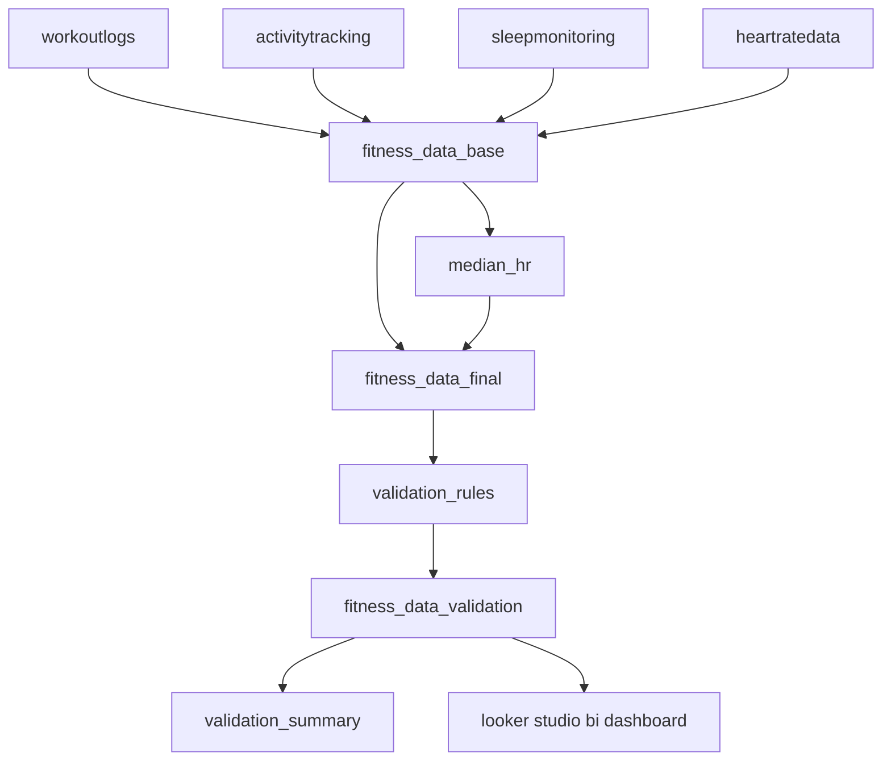

# etl pipeline
this document provides a high-level overview of the power query etl (extract-transform-load) process for the **fitness analytics etl + bi** project.  
it describes the architecture, logical flow, and key components used to transform fragmented fitness tracking data into a clean, analytics-ready dataset.

## overview
the etl pipeline integrates four raw data sources - workouts, activity, sleep, and heart rate - from a single excel file:  
[`/data/sample/fitness_data_raw_sample.xlsx`](../data/sample/fitness_data_raw_sample.xlsx).  

through a series of standardized transformations, these sources are cleaned, normalized, merged, and enriched into one unified dataset:  
**`fitness_data_final`**, later validated in the [`/validation`](../validation) stage before visualization in looker studio.

## etl architecture

## etl logic components
| component | location | description |
|------------|-----------|-------------|
| **etl functions** | [`/etl/functions`](./functions) | reusable m-language scripts for cleaning, parsing, and standardization (e.g., `fx_clean`, `fx_date`, `fx_number`, `fx_text`). |
| **etl queries** | [`/etl/queries`](./queries) | main transformation logic: imports, cleans, joins, and aggregates raw sheets into unified datasets. |
| **raw data** | [`/data/sample/fitness_data_raw_sample.xlsx`](../data/sample/fitness_data_raw_sample.xlsx) | input file containing 4 worksheets: `WorkoutLogs`, `ActivityTracking`, `SleepMonitoring`, and `HeartRateData`. |
| **output dataset** | [`fitness_data_final`](./queries/fitness_data_final.pq) | final table containing standardized, enriched daily metrics ready for validation. |

## etl flow
1. **source loading**  
   - imports four excel worksheets and promotes headers  
   - uses `fx_clean` to standardize header names and trim text cells  
2. **cleaning & normalization**  
   - converts raw text, numeric, and date fields into consistent formats  
   - uses helper functions:  
     - `fx_date` – parses multiple date formats and excel serials  
     - `fx_number` – standardizes numeric input, handles `k` suffix and `%`  
     - `fx_to_minutes`, `fx_to_hours`, `fx_to_km` – converts mixed-unit data to consistent numeric scales  
     - `fx_text` – normalizes casing, whitespace, and punctuation  
3. **merging & enrichment**  
   - joins daily tables (`WorkoutLogs`, `ActivityTracking`, `HeartRateData`, `SleepMonitoring`) by `date`  
   - computes per-day metrics (duration, calories, steps, sleep, hr averages)  
   - ensures one-to-many structure is handled via left joins  
4. **aggregation & imputation**  
   - creates a median table (`median_hr`) to fill missing heart rate values per workout type  
   - imputes missing average HR values when valid median exists  
   - derives calculated columns (`calories_per_minute`, `steps_goal_pct`, `workout_intensity`, etc.)  
5. **calendar integration**  
   - adds a full date dimension (2024) to ensure continuous daily coverage  
   - includes additional columns: `month_name`, `quarter_name`, `day_of_week`, and others  
6. **validation handoff**  
   - the resulting table `fitness_data_final` is used as input for the validation process  
   - validation rules and functions are defined in [`/validation`](../validation)  
   - output from validation includes:  
     - `fitness_data_validation` – full dataset with applied rules  
     - `validation_summary` - aggregated error and completeness overview  

## output datasets
| dataset | description |
|----------|-------------|
| **fitness_data_final** | complete, standardized daily dataset ready for validation and reporting. |
| **fitness_data_validation** | extended version of `fitness_data_final` with validation flags and rule results (see `/validation`). |
| **validation_summary** | aggregated validation report summarizing data quality status. |

sample outputs available in:  
[`/data/sample/fitness_data_validation_sample.xlsx`](../data/sample/fitness_data_validation_sample.xlsx)

## related documentation
- [**etl-walkthrough**](./etl-walkthrough.md) – detailed step-by-step guide for each transformation stage  
- [**validation-walkthrough**](../validation/validation-walkthrough.md) – post-etl validation process  
- [**etl-functions**](./functions) – reusable helper scripts  
- [**etl-queries**](./queries) – all core transformation scripts  

## notes
- data buffering is used selectively for performance where required.  
- etl logic is modular and can be easily extended to additional data sources or metrics.  

📅 *last updated: october 2025*  
👩‍💻 *author: Monika Burnejko*
