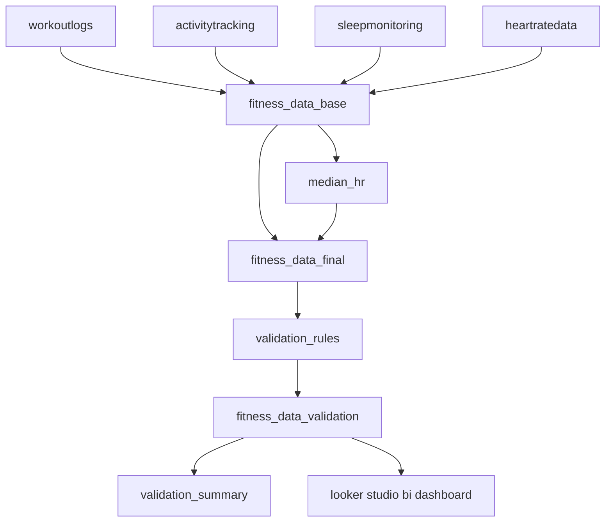

# etl pipeline
this document provides an etl architecture overview and the power query data flow for the project. the pipeline ingests four excel worksheets from a single raw file, standardizes and enriches them with reusable m functions, merges them into a unified daily dataset, and prepares the final model for bi consumption. samples of the raw inputs are available in `/data/sample/fitness_data_raw_sample.xlsx`.

## data sources
- **workoutlogs** - per-workout records (date, workout_type, duration, calories)
- **activitytracking** - daily activity (date, steps, distance_km, active_minutes)
- **sleepmonitoring** - daily sleep (date, sleep_hours)
- **heartratedata** - daily heart rate (date, average_hr, max_hr, resting_hr)
> raw sheets are read from a single file: `fitness_data_2024_raw.xlsx` (samples in `/data/sample/fitness_data_raw_sample.xlsx`)

## transformation structure (queries)
- **workoutlogs**  
  clean + normalize text; parse dates; map workout_type to canonical labels; convert duration to minutes; parse calories; enforce types; remove duplicates.
- **activitytracking**  
  clean; parse dates; steps via `fx_number(_, true, false)` (k-suffix enabled); distance to km; active minutes to integer; sort + dedupe by date.
- **sleepmonitoring**  
  clean; parse dates; convert sleep durations to hours (supports `hh:mm[:ss]`); sort + dedupe by date.
- **heartratedata**  
  clean; parse dates; parse hr metrics to numbers; group by date with rules: average/resting → rounded average; max → maximum.
- **fitness_data_base**  
  nested joins by date to combine activity/hr/sleep with workouts; per-day logic: if any workout exists that day → keep only rows with a nonblank `workout_type`; otherwise keep all rows; cast final types.
- **median_hr**  
  compute median `average_hr` per `workout_type` (rounded to int).
- **fitness_data_final**  
  left join calendar (2024) to base; impute `average_hr` from per-type median (with `average_hr_imputed_flag`); derive metrics: `calories_per_minute`, `workout_intensity`, `sleep_duration_group`, `steps_goal_pct`, `steps_goal_achieved_flag`; `sleep_previous_night` via index/shift; add calendar attributes (month/dow/quarter); final casting and column order.

## functions used (etl)
- **fx_clean** - remove empty rows, trim text cells, normalize headers to snake_case.
- **fx_text** - clean whitespace/control chars, normalize punctuation, casing control.
- **fx_number** - robust numeric parsing with k/% (opt-in flags), separator unification, fuzzy token cleanup.
- **fx_date** - typed/date/datetime fast paths, excel serials, iso-like parsing, culture-backed `date.fromtext` (default priority: `{"en-GB","en-US","pl-PL"}`).
- **fx_to_minutes** - parse `hh:mm[:ss]`, `1h30min`, `90min` → minutes.
- **fx_to_hours** - parse `hh:mm[:ss]`, `1h30m`, `90min` → hours.
- **fx_to_km** - parse `km/m/mi`, glued forms allowed, miles fixed at `× 1.609`.
> note on types: final casts use `"en-US"` culture to ensure dot decimal handling is consistent across systems.

## m query files
all power query m scripts are stored under `/etl/queries/`.  
file naming mirrors query names, e.g.: `workoutlogs.pq`, `activitytracking.pq`, `sleepmonitoring.pq`, `heartratedata.pq`, `fitness_data_base.pq`, `median_hr.pq`, `fitness_data_final.pq`.

## validation (brief)
after `fitness_data_final`, a validation stage checks completeness and logical bounds and produces outputs illustrated in `/data/sample/fitness_data_validation_sample.xlsx`. details live under `/validation/`. 
components:
- **validation functions:** `fx_null_or_blank`, `fx_is_numeric`, `fx_is_between`, `fx_in_set`, `fx_list_broken`
- **validation_rules:** parameterized table of rules in `/validation/`
- **fitness_data_validation:** per-row, per-rule results
- **validation_summary:** rule-level and field-level aggregates
see: `/validation/validation_walkthrough.md` for the full validation workflow.

## data flow

📅 *last updated: october 2025*  
👩‍💻 *author: Monika Burnejko*
