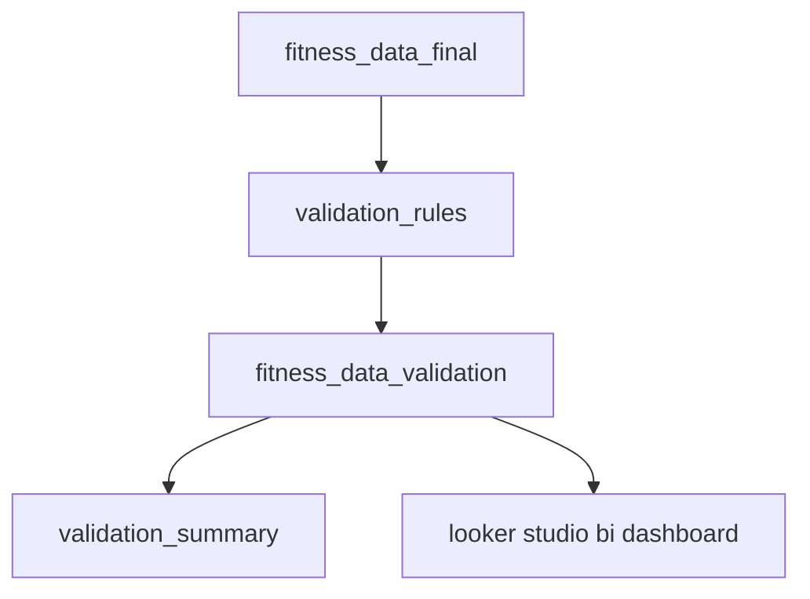

# validation walkthrough
this document describes the full validation process applied after the etl pipeline in the **fitness analytics etl + bi** project.  
it details how data quality rules are defined, executed, and summarized across the final dataset (`fitness_data_final`).

## overview
after the etl stage completes, the dataset is fully standardized and merged into a single table - [`fitness_data_final`](../etl/queries/fitness_data_final.pq).  
the validation process then performs structured data quality checks to ensure consistency, completeness, and logical correctness.

validation outputs two final tables:
- `fitness_data_validation` - record-level validation results  
- `validation_summary` - aggregated summary of validation and completeness metrics  

sample outputs are available in `/data/sample/fitness_data_validation_sample.xlsx`.

## validation architecture
the validation pipeline follows a modular design:


## validation logic components
| component | location | description |
|------------|-----------|-------------|
| **validation_rules** | `/validation/queries/validation_rules.pq` | defines all validation checks (rule name, target column, rule type, parameters, and severity). |
| **validation functions** | `/validation/functions/` | reusable m functions implementing logic for null checks, numeric ranges, set membership, and relational comparisons. |
| **fitness_data_validation** | `/validation/queries/fitness_data_validation.pq` | applies each rule dynamically to every record, producing `rule_*` columns and aggregating error/warning flags. |
| **validation_summary** | `/validation/queries/validation_summary.pq` | groups results by validation status (`valid`, `check`, `invalid`, `nodata`) and completeness (`complete`, `incomplete`). |

## validation flow
1. **load final dataset and rules**
   - imports `fitness_data_final` (final table from etl)
   - imports `validation_rules` (rule definitions)
2. **apply validation functions**
   - iterates through all records and applies the correct validation function:
     - `fx_null_or_blank` → checks non-empty fields  
     - `fx_is_between` → validates numeric ranges  
     - `fx_is_numeric` → verifies numeric types  
     - `fx_in_set` → enforces allowed categorical values  
     - `fx_list_broken` → collects all failed rule names  
   - creates one `rule_<rule_name>` column per rule, returning logical values (`true`, `false`, or `null`)
3. **identify broken rules**
   - failed rules are listed in `broken_rules`  
   - each broken rule is cross-referenced with its severity level (`error` / `warn`)
4. **derive validation flags**
   - `has_error` = any broken rule with severity `error`  
   - `has_warn` = any broken rule with severity `warn`  
   - `data_validation_flag` summarizes each record:  
     - `valid` → all rules passed  
     - `check` → only warnings  
     - `invalid` → at least one error  
     - `nodata` → record contains no relevant data  
5. **assess data completeness**
   - marked as `complete` when:
     - `date` is not null  
     - key columns (`workout_type`, `sleep_hours`, `average_hr`, `steps`, `calories_burned`, `workout_duration_min`) are not null  
     - at least one validation rule was successfully evaluated  
   - otherwise marked as `incomplete`
6. **aggregate results**
   - `validation_summary` combines two dimensions:  
     - `metric` - validation / completeness  
     - `label` - category (e.g., `valid`, `check`, `invalid`, `nodata`, `complete`, `incomplete`)  
   - includes record counts and percentage share of total records.

## rule structure
each rule in `validation_rules.pq` defines:
| field | description |
|--------|-------------|
| `rule_name` | unique identifier for the rule |
| `target_column` | dataset column being validated |
| `rule_type` | logical type (`not_null`, `between_inc`, `max_inc`, `in_set`, `rel_compare`) |
| `param1` / `param2` | optional rule parameters |
| `severity` | either `error` or `warn` |

example rule:
```text
{"range_average_hr_70_150","average_hr","between_inc",70,150,"error"}
```

## output tables
### fitness_data_validation
record-level validation output containing:
- **all original columns** from [`fitness_data_final`](../etl/queries/fitness_data_final.pq)
- one additional column per rule (`rule_*`)
- derived validation columns:
  - `broken_rules` – list of failed rule names  
  - `has_error` – at least one rule failed with severity = error  
  - `has_warn` – at least one rule failed with severity = warn  
  - `data_validation_flag` – overall record status (`valid`, `check`, `invalid`, `nodata`)  
  - `data_completeness` – completeness assessment (`complete`, `incomplete`)
  
<br>this table serves as the **base dataset for both validation_summary and looker studio visualizations**.

### validation_summary
aggregated summary of validation and completeness results:
- `metric` - validation / completeness  
- `label` - category (e.g., `valid`, `check`, `invalid`, `nodata`, `complete`, `incomplete`)  
- `record_count` - total records per category  
- `percent_of_total` - percentage share of total records

## related documentation
- [/validation/functions/](./functions) - reusable helper functions used across all validation queries.
- [/validation/queries/](./queries) - includes rule definitions (`validation_rules.pq`), record-level validation logic (`fitness_data_validation.pq`),  
  and summary aggregation (`validation_summary.pq`).
- [/etl/etl-pipeline.md](../etl/etl-pipeline.md) - describes the full data flow from raw files through the power query transformation process.
- [/etl/etl-walkthrough.md](../etl/etl-walkthrough.md) - detailed step-by-step explanation of each etl query, transformation stage, and resulting tables.
- [/data/sample/](/data/sample/) - contains reference excel files such as `fitness_data_raw_sample.xlsx` and `fitness_data_validation_sample.xlsx`, demonstrating input and post-validation results.

## notes
- rule logic is modular and easily extendable.
- null and blank handling is consistent across all functions.
- validation ensures full data reliability before reporting and visualization.

📅 *last updated: october 2025*  
👩‍💻 *author: Monika Burnejko*
